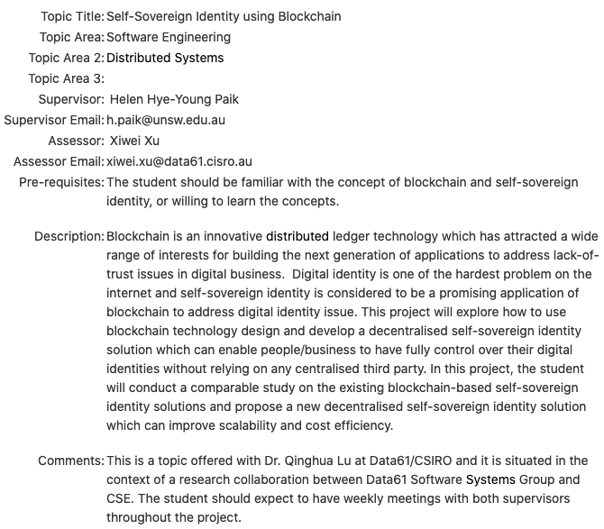
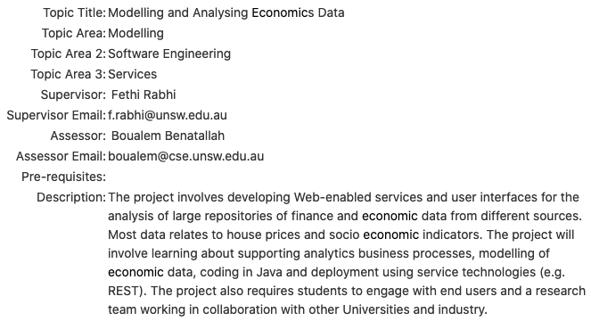
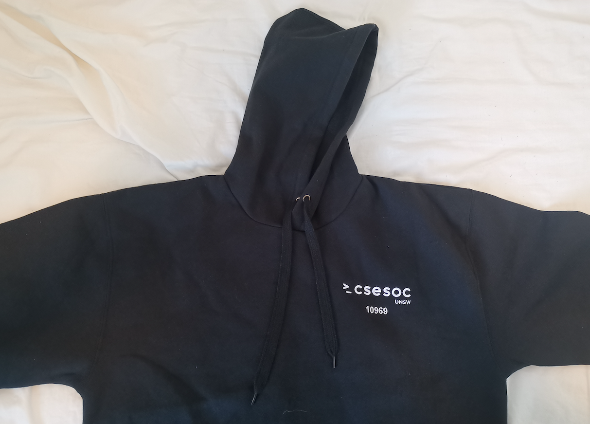
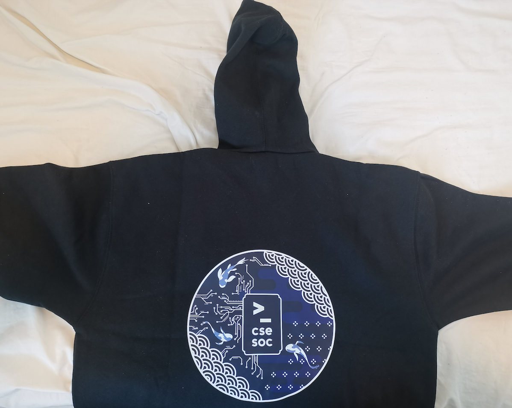

Just spent the entire day reading through all the thesis topics and applying to them. Turns out I should've started doing this weeks ago but the school never said anything about it, so I guess I'll just start now 🤷. All the topics sounded kinda boring, but there were two that seemed pretty cool.

The first one is blockchain related. I still don't know what blockchains actually are, but hey, that's what the thesis is for right. Surely I'll ace the thesis and solve world hunger or something using blockchain and be remembered for centuries. Some legends are told 🎶 some turn to dust or to gold 🎶 but you will remember me 🎶 remember me for centuries 🎶 du du du du du du du. But yeah so I emailed the supervisor and she responded back within five minutes, which was pretty impressive. Gonna schedule a call to talk about it next week, should be cool, can't wait to learn about blocky chains. Let's go.

The second one is about economics and house prices, which sounds pretty relatable because my generation won't be able to afford houses in the future, so it's cool to model it out and show that with concrete evidence. JK, it seemed interesting since it's web-related and also involves some economics, and because I've bought a stock or two in the past I'm basically a seasoned investor at this point, so this thesis should be a piece of cake. Emailed the supervisor and he still hasn't responded back yet, that's minus five points from me dawg.

Also got the hoodie that I ordered so long ago that I completely forgot about, so I was pleasantly surprised by the email telling me to pick it up today. The design is 🔥 and I also got to have a custom caption under the logo, which is pretty nice.

So what exactly does 10969 mean? Why don't you search it up 😛.
