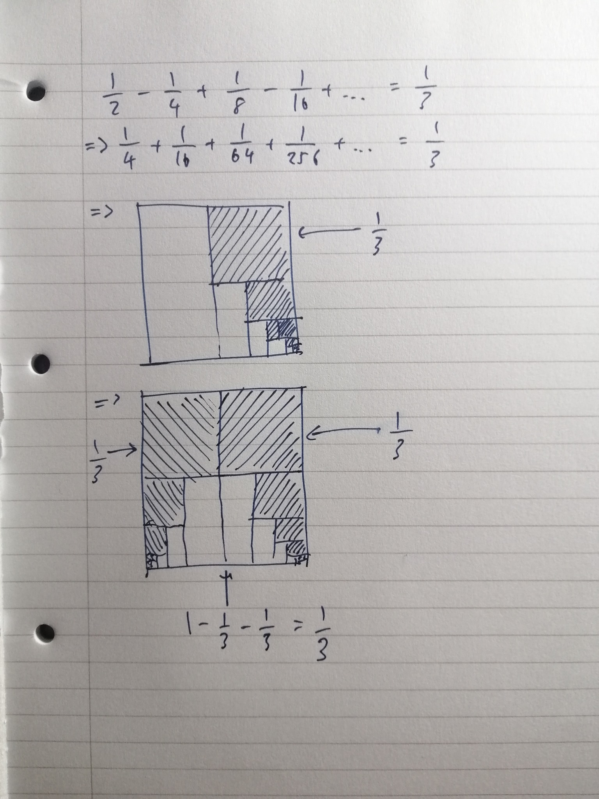

I was watching Veritasium's [latest video](https://youtu.be/3LopI4YeC4I) today when he mentioned a study which concluded that if you gave four cookies to a team of three, the team lead would more than likely take the extra cookie. This makes sense, since the entire point of being a team lead is to take more cookies than the team members. Just kidding, hope my team doesn't see this post. But what if you could break the extra cookie into bits to distribute them evenly among the team members? In order for that to work, we need to assume that you can only break the cookie in half each time, since any other division produces too much cookie crumbs, which is too wasteful.

So the problem essentially boils down to whether it's possible to get $\frac{1}{3}$ from $1$ if we can only divide by $2$ each time. I thought about it for a couple of minutes and couldn't really figure it out, so I had to ask a friend for help. Turns out we can by using [Archimedes' quadrature of the parabola](https://en.wikipedia.org/wiki/The_Quadrature_of_the_Parabola), which is just
$$
\sum_{n=0}^{\infty}4^{-n}=1+\frac{1}{4}+\frac{1}{16}+\frac{1}{64}+\cdots=\frac{4}{3}
$$
, as a starting point. This means that
$$
\sum_{n=1}^{\infty}4^{-n}=\frac{1}{4}+\frac{1}{16}+\frac{1}{64}+\cdots=\frac{1}{3}
$$
, which shows that in order to get $\frac{1}{3}$ of a cookie, we would have to break the original cookie by half, then break the two halves by half again to get four quadrants, finally applying the same method recursively on one of the four quadrants, at the end picking up one quadrant from each of the iterations to form $\frac{1}{3}$ of the cookie, giving everyone in the team an equal amount of cookies.

Communism prevails.

