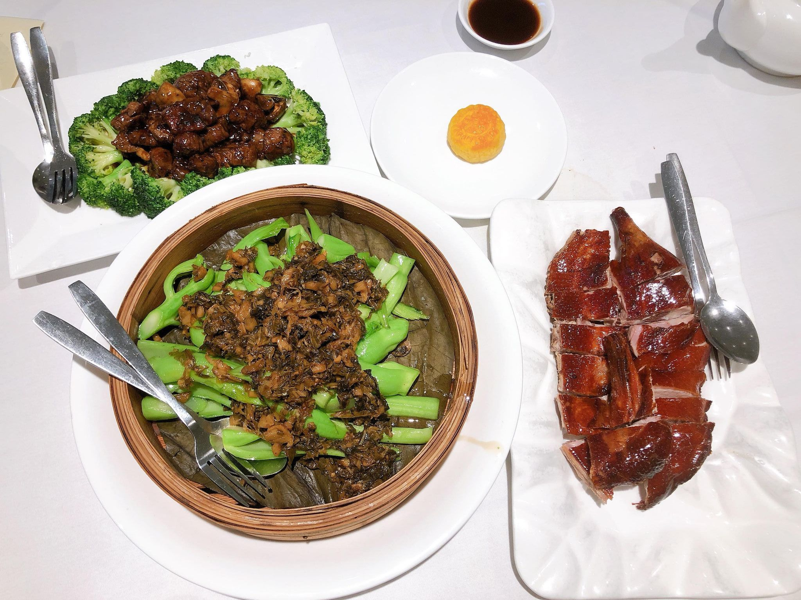
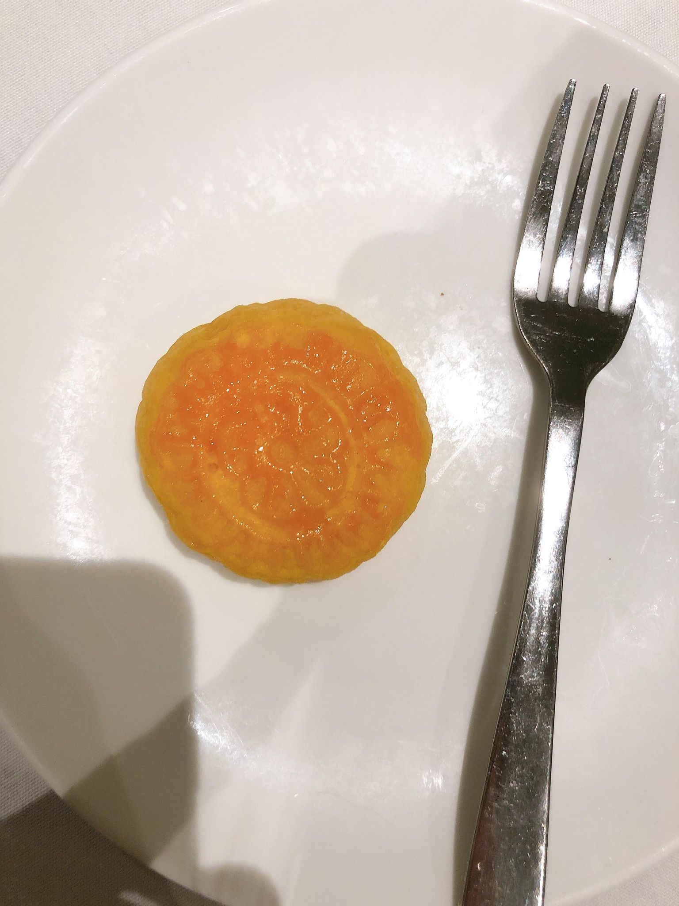

So I decided to start rock climbing again after destroying my ankle earlier this year, it's pretty much healed now, although it still hurts a little bit if I fully stretch it, but oh well, should be fine, hopefully I don't get severe arthiritis in the future. Just went this Thursday, which is when I usually go every week now, it was also coincidentally the Mid-Autumn Festival, which is some important festival in the Asian culture where people gather around and eat food. That's pretty much what festivals are anyway, just excuses to gather around and eat things, which is completely fine. It's like going to lectures, since I don't really go to lectures for the content, I just go to meet up with friends afterwards and hang. I actually forgot what the festival is supposed to celebrate, but that's not important, as long as the mooncakes taste good, all is well.

Anyway so it was my fourth time in the rock climbing gym and I was able to do two grade-17 paths and one tilted grade-15 path, which was some pretty dope progress compared to last week where I failed the tilted grade-15 path. It's actually pretty hard because it tilts outwards, which means you have to grab onto the rocks for dear life, otherwise if you lose grip and swing out, you won't be able to grip the rocks again and have to be roped down in shame. But at least you are protected with a harness, unlike bouldering where you just go freestyle and if you fall then it eez what it eez. That's actually how I sprained my ankle earlier this year, so just gonna take it easy now and go rock climbing instead of bouldering for a while.

After climbing some rocks we went to grab dinner, since it was the festival and all, we just went to the first Asian place we saw, which turned out to be a yum cha restaurant. It was actually one of the few times I went to a yum cha restaurants at night, since you're supposed to go during the day and have tea with dim sum. But the food was aight, they had all the typical Chinese dishes as well, and we also managed to get their last mooncake which tasted like a Japanese cheese cake, so they get a 10/10.

So why is this post called Fly On the Wall? Because I'm gonna be so good at rock climbing that I'll stick to the wall like a fly, and it's also [one of my favourite songs](https://youtu.be/y5A_ywn__nE) by the one and only Thousand Foot Krutch.
