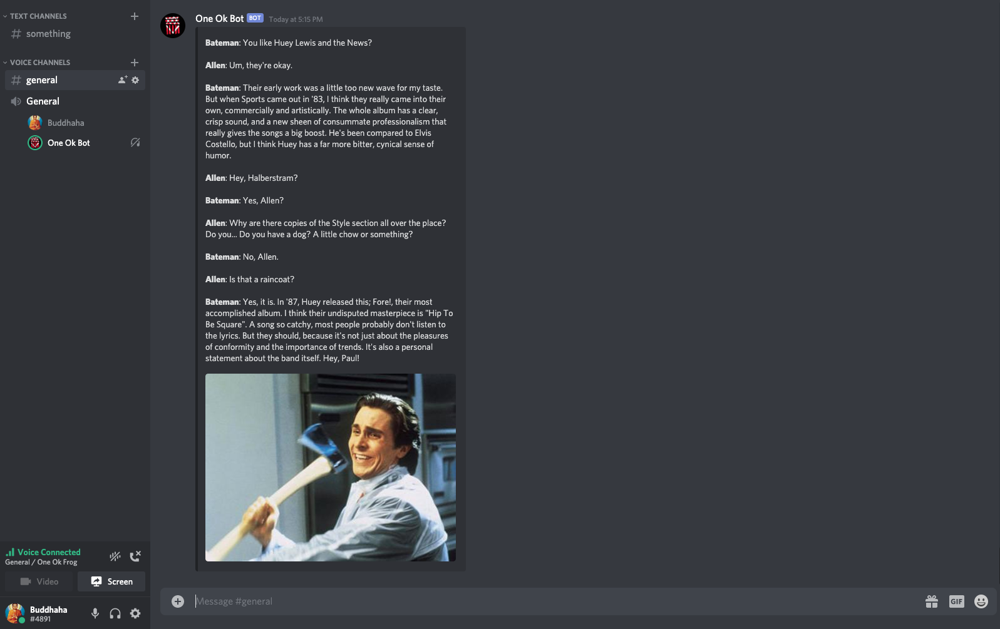

So I just had the most brilliant idea I've ever had this week when I was doing my last exam. Wouldn't it be funny if I added a new command to One Ok Bot that played the song Hip to be Square and outputted the dialogue exchange between Patrick Bateman and Paul Allen in the movie American Psycho? For those that don't know, Patrick Bateman plays Hip To Be Square right before he murders Paul Allen with an axe in American Psycho, which is a pretty decent movie.

Aight time to implement it.

## Command

Since this command plays Hip To Be Square, naturally it should be `!hip`.

## Behavior

I thought about it and there's really three things that this command should do.

1. Plays Hip To Be Square
2. Prints the dialogue exchanged before Paul Allen dies in a Discord message
3. Embeds [this image](https://i.kym-cdn.com/entries/icons/facebook/000/008/301/christian_bale_american_psycho_patrick_bateman_axe_10989289_RE_PwnzElite_has_declared_war_on_Grammar_Nazis-s400x300-173837.jpg) into the same message

## Implementation

I need to first find Hip To Be Square on Youtube. Fortunately it has an official [music video](https://youtu.be/LB5YkmjalDg) from the band's channel, so it should be around for a pretty long time and I won't need to worry about the video getting copyright-striked.

Since I have a configuration system in place already, adding the link is not too hard. I'll just need to add another entry to the YAML configuration file.

```yml:title=src/main/resources/default.yml {10}
bot:
  prefix: "!"
  owner: "142918778232111104"
  helpCommand: "huh"

audio:
  lofiURL: "https://youtu.be/5qap5aO4i9A"
  rockURL: "https://www.youtube.com/playlist?list=PLFiObAyJn6E4xsjQGKzErYMznxmp6Ssn3"
  noScaredURL: "https://youtu.be/fL-bM8UKIWs"
  hipToBeSquareURL: "https://youtu.be/LB5YkmjalDg"
```

Now I'll need to make the configuration manager recognize the newly-added entry and use it, which involves

1. Adding another field to the audio specification, since the Hip To Be Square URL is audio-related and it's also in the audio section of the YAML
2. Adding another attribute to the configuration manager and make it recognize the new field in the audio specification

```kt:title=src/main/kotlin/bot/configurations/specifications/AudioSpec.kt {20-21}
package bot.configurations.specifications

import com.uchuhimo.konf.ConfigSpec

/**
 * A class which stores the audio specifications
 *
 * This is used by Konf and will not be accessed externally
 */
object AudioSpec : ConfigSpec() {
    /* Link to the lo-fi beats stream */
    val lofiURL by required<String>(description = "Link to the lo-fi beats stream")

    /* Link to a One Ok Rock playlist */
    val rockURL by required<String>(description = "Link to a One Ok Rock playlist")

    /* Link to No Scared */
    val noScaredURL by required<String>(description = "Link to No Scared")

    /* Link to Hip To Be Square */
    val hipToBeSquareURL by required<String>(description = "Link to Hip To Be Square")
}
```

<br/>

```kt:title=src/main/kotlin/bot/configurations/Configurations.kt {46-47}
package bot.configurations

import bot.configurations.specifications.AudioSpec
import bot.configurations.specifications.BotSpec
import com.uchuhimo.konf.Config
import com.uchuhimo.konf.Feature
import com.uchuhimo.konf.source.yaml

/**
 * Central class representing the bot's configuration, wrapping a Konf [Config] object
 *
 * Configuration is loaded from two locations, with values from earlier locations being overwritten by values in later
 * locations
 * 1) The default.yml file found in resources
 * 2) Environment variables defined at run-time
 * 3) System properties defined at run-time
 */
class Configurations {
    /* Configuration map */
    private var configurations = Config { addSpec(BotSpec); addSpec(AudioSpec) ; }
        .from.enabled(Feature.FAIL_ON_UNKNOWN_PATH).yaml.resource("default.yml")
        .from.env()
        .from.systemProperties()

    /* Bot login token */
    val token: String get() = configurations[BotSpec.token]

    /* Bot command prefix */
    val prefix: String get() = configurations[BotSpec.commandPrefix]

    /* ID of the bot's owner */
    val owner: String get() = configurations[BotSpec.owner]

    /* Command to ask for help */
    val helpCommand: String get() = configurations[BotSpec.helpCommand]

    /* Link to the lo-fi beats stream */
    val lofiURL: String get() = configurations[AudioSpec.lofiURL]

    /* Link to a One Ok Rock playlist */
    val rockURL: String get() = configurations[AudioSpec.rockURL]

    /* Link to No Scared */
    val noScaredURL: String get() = configurations[AudioSpec.noScaredURL]

    /* Link to Hip To Be Square */
    val hipToBeSquareURL: String get() = configurations[AudioSpec.hipToBeSquareURL]
}

/**
 * The singleton [Configurations]
 *
 * This should always be used instead of constructing an instance of [Configurations] manually
 */
val configurations = Configurations()
```

Last but not least I'll need to implement the command itself and its three behaviors, which involves

1. Creating another audio load handler class, which specifies what to do when a track / playlist is loaded, and have it inherit from `QuietAudioLoadHandler`. This is so that I only have to override certain methods to implement the behaviors specific to `!hip`, while having everything else use the implementation defined in `QuietAudioLoadHandler`, which loads the tracks / playlists quietly without causing any side effects to Discord
2. Creating a new command class, have it load Hip To Be Square, and pass in the new audio load handler I just made as the audio load handler specific to this command

```kt:title=src/main/kotlin/bot/handlers/audioLoadHandlers/HipAudioLoadHandler.kt
package bot.handlers.audioLoadHandlers

import bot.exceptions.AuthorNotConnectedToVoiceChannelException
import com.jagrosh.jdautilities.command.CommandEvent
import com.sedmelluq.discord.lavaplayer.track.AudioTrack
import net.dv8tion.jda.api.EmbedBuilder

class HipAudioLoadHandler(private val event: CommandEvent) : QuietAudioLoadHandler(event) {
    override fun trackLoaded(track: AudioTrack) {
        try {
            val builder = EmbedBuilder()

            connectToVoiceChannel()

            builder.setDescription(javaClass.getResource("/copypastas/hip_to_be_square.txt").readText())
            builder.setImage("https://i.kym-cdn.com/entries/icons/facebook/000/008/301/christian_bale_american_psycho_patrick_bateman_axe_10989289_RE_PwnzElite_has_declared_war_on_Grammar_Nazis-s400x300-173837.jpg")

            musicManager.scheduler.queue(track)

            event.reply(builder.build())
        } catch (exception: AuthorNotConnectedToVoiceChannelException) {
            notifyAuthorNotConnected()
        }
    }
}
```

<br/>

```kt:title=src/main/kotlin/bot/commands/HipCommand.kt
package bot.commands

import bot.configurations.configurations
import bot.handlers.audioLoadHandlers.HipAudioLoadHandler
import bot.sounds.audioPlayerManager
import com.jagrosh.jdautilities.command.Command
import com.jagrosh.jdautilities.command.CommandEvent

/**
 * Class that represents the !hip command
 *
 * Clears the queue and plays Hip To Be Square
 */
class HipCommand : Command() {
    init {
        name = "hip"
        help = "Clears the queue and plays Hip To Be Square"
        category = Category("Music")
    }

    override fun execute(event: CommandEvent) {
        val guild = event.guild
        val musicManager = audioPlayerManager.findGuildMusicManager(event.guild)

        musicManager.scheduler.clear()

        audioPlayerManager.loadAndPlay(guild, configurations.hipToBeSquareURL, HipAudioLoadHandler(event))
    }
}
```

## Result

Yeyeye doesn't look too bad ey?


