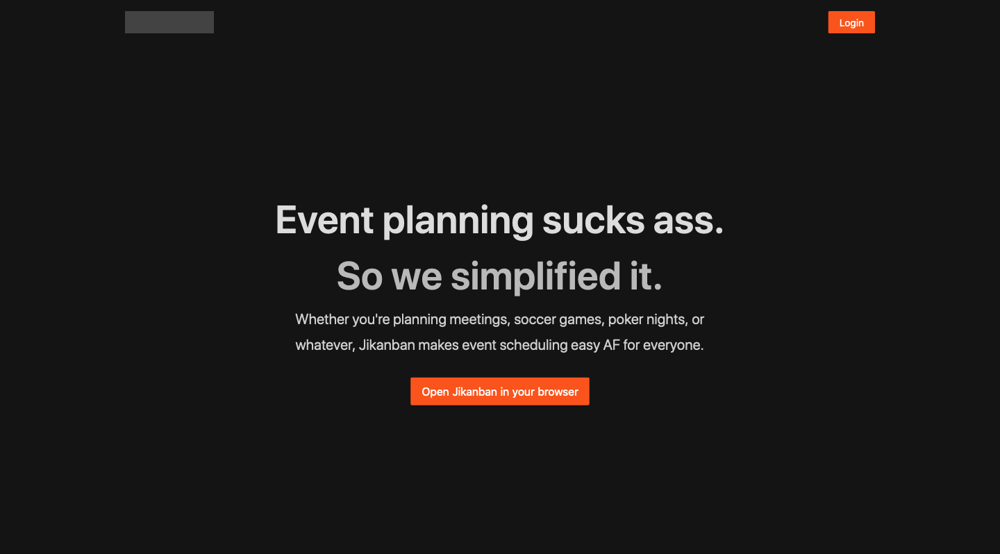

Having a dope landing page is extremely important. It sets the tone for the rest of the application and is what people will use to judge if the service is worth using or not. It's pretty hard to make a good landing page these days since everyone's already used all sorts of formats, so it's really difficult to have a landing page that's truly unique and eye-grabbing. After all, if a landing page doesn't add to the personality of the app, then it might as well not be there. Some of y'all might say, "bUt LaNdInG pAgE pRoViDeS iNfOrMaTiOn To ThE uSeRs", yeah well if the rest of the UI/UX is good enough then you don't need an entire page to explain what the app does, just chuck that in the description field of the search result and call it a day, since that's the first thing new users will see anyway.

A decent landing page also needs to have a spicy hero message, which is the massive text that you'll most likely see first when you land on a website. It should aim to provide a very short description of the app or the problem while being unique enough to hold your attention so that you're more likely to read what's below it. This means that it can't be generic or boring, since otherwise you'll just roll your eyes and move on to the sign up screen, or, worse, close the page altogether, since if the hero message is boring then the rest of the app probably is as well. So if you can't think of a good enough hero message, then don't even have a landing page at all. Moving on, the section below the hero message usually just contains some useless crap that actually describes the application, but don't sweat about it too much because most people won't really care about it anyway. It's just there so the page doesn't feel too empty.

Combining everything that I've talked about in the previous paragraphs together, I was able to come up with the landing page for Jikanban. which is absolutely beautiful.

