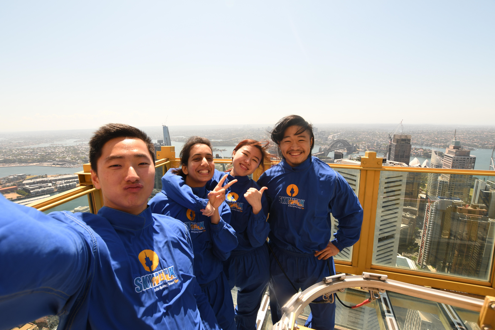
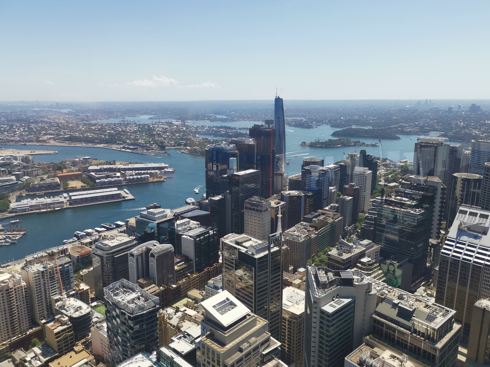
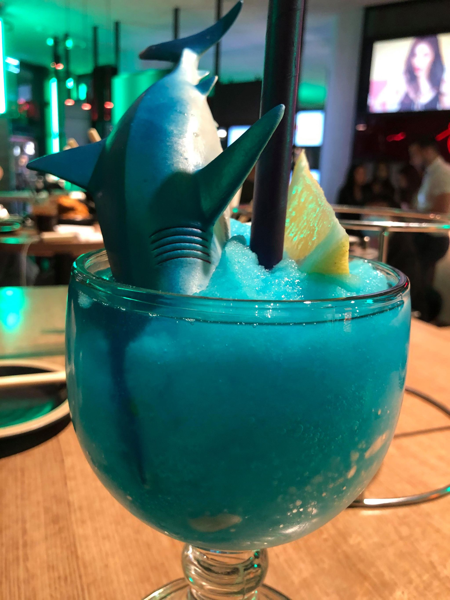

import SharknadoLemonMp4 from './sharknado_lemon.mp4'
import SharknadoInsideMp4 from './sharknado_inside.mp4'
import CheeseChickenMp4 from './cheese_chicken.mp4'

I was originally gonna write about the skywalk that I did this Thursday, but I'm tired and you can't always get what you want, so I'll just put some photos here instead. Long story short, we went to the top of the Sydney Tower Eye, looked down on the skyline for a bit, and took some photos. It was also pretty windy up there so none of us could open our eyes, that probably didn't make much difference though since we're all Asian anyway 😎.

So yeah that was pretty dope, but not as 🔥 as the Van Gogh exhibition that I just got back from today. So basically there's a new exhibition in town that recreates Van Gogh's artworks on big screens and whatever, probably because they didn't have the money to actually borrow his paintings for the event, but that's fine. Various paintings were projected onto the screens, with each iteration being 45 minutes long and ending in the classic starry night painting, which is probably what everyone saw on Instagram and came to the event for anyway. The annoying thing is that each painting only lasts 10 seconds or so, even starry night only lasts about a minute, so you need to be quick in finding a spot and taking photos before it all vanishes and you ending up having to wait another 45 minutes again for the same painting to show up. We actually had to wait for a second iteration of starry night because we didn't have enough time to take decent enough photos for the first iteration. Oh well, at least that allowed us to exit the exhibition perfectly at dinner time.

<video width="100%" controls>
  <source src={SharknadoLemonMp4} type="video/mp4" />
</video>

<video width="100%" controls>
  <source src={SharknadoInsideMp4} type="video/mp4" />
</video>

<video width="100%" controls>
  <source src={CheeseChickenMp4} type="video/mp4" />
</video>

Dinner was pretty nice, we just went to a chicken restaurant called Goobne, I still don't know if it's supposed to be pronounced as Gooben or Goobnie, oh well. I ordered a drink that has a shark in it called Sharknado, pretty sick name, and it turned out that they actually stuffed sauce or whatever inside the shark, so it felt like squeezing out its insides when I was getting the sauce out. No animals were harmed in the making of this post though. The chicken was pretty aight as well, you're supposed to wrap it in cheese to get rid of the spiciness, which didn't really work. Luckily I had the Sharknado to soothe my mouth while eating the spicy chicken, so that was a pretty good decision.

Did you think this post's called Starry Night because it's one of Van Gogh's most popular paintings? Partially, it's also because there's a [dope K-pop song](https://youtu.be/0FB2EoKTK_Q) by the same name from the one and only Mamamoo.
