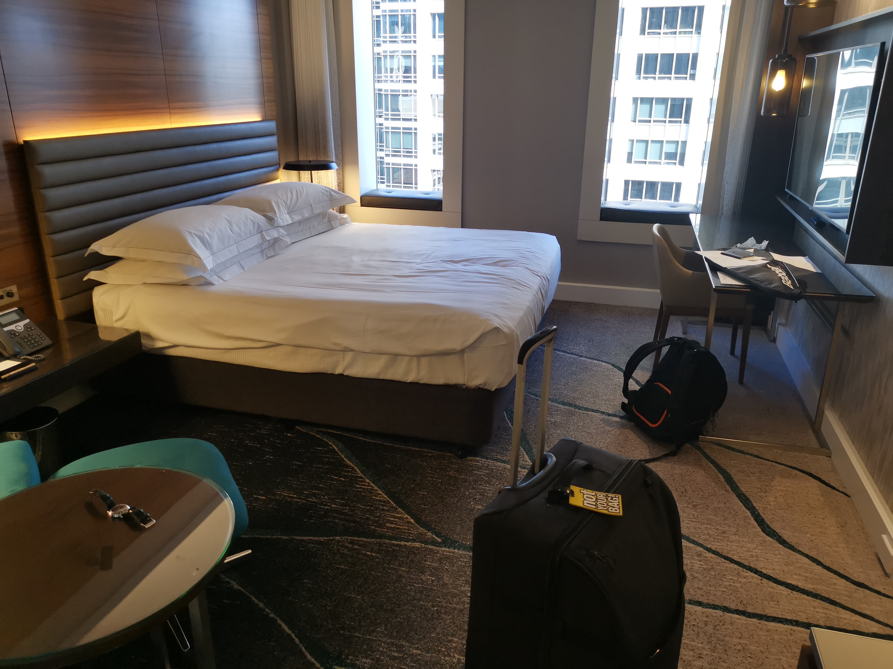
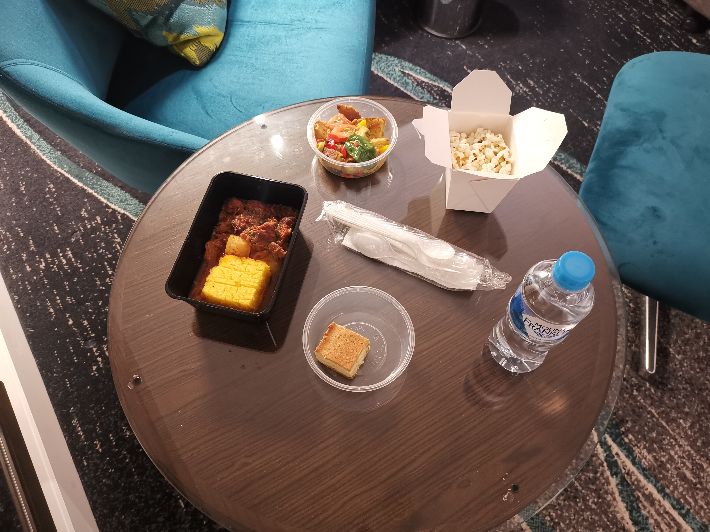

It's ya boi back in Sydney again after so long. This time the circumstances are a bit different since there's a global pandemic going on, so all arrivals need to quarantine for two weeks. It's pretty funny as well since NZ just got out of lock down literally yesterday, so I've basically gotten out of the frying pan and straight into the fire. But anyway, here's a review of the quarantine experience.

## Flight

Checked in early AF because I received a message six hours before departure time telling me to arrive at least three hours early at the airport since checking in during corona might take a long time. Nek minnit, it only took one hour and I spent the remaining two hours taking a fat nap. Had to wear a mask all the way as well, which felt kinda uncomfortable. Almost had to invoke my first amendment rights in order to breathe freely again 🇺🇸.

## Hotel

A pretty important factor of the quarantine life, since you're gonna have to spend two weeks of your life there in an air-tight room without being able to go outside even for walks, which sounds like shit but can be aight if you get a good roll for the hotel. AFAIK there are several hotels in Sydney that are used to quarantine arrivals

- Swissotel
- Meriton Suites
- Ibis Darling Harbour
- InterContinental
- Four Seasons
- Hilton

Of which Ibis Darling Harbour, InterContinental, and Four Seasons provide sea view, while the others just provide uninteresting views. Apparently there are also less luxurious hotels that you have to move to if you get tested positive while in quarantine, not sure though, only one way to find out I guess.

## Hilton

This is the hotel that I got assigned to out of the ones listed above, which is not a bad roll. I'm on the 21st floor, which is 10 more than the floor that Patrick Bateman lives on, so the view is not too bad, although it's only of the CBD so there's not many interesting things going on. The room is pretty typical for a hotel room, except it's got a massive smart TV and I was able to hook my laptop to it with a HDMI cable dangling behind it, so now I get to watch pirated Mr. Robot on a bigger screen. BTW season three was 👌😩👍 so y'all gotta check it out if you haven't already.

## Food

We get served three meals a day, which, of course, are

- Breakfast: 7:45 a.m.
- Lunch: 12 p.m.
- Dinner: 6 p.m.

The food tastes pretty aight, slightly better than airplane food, so it gets a 8/10. Quite a bit of variety as well, plenty of protein to make you not lose gains during quarantine, salads to make you not feel like shit after eating all that meat, and water to keep you hydrated.

Well anyway, I'm getting out on the 15th of September, so see y'all then. HMU if you wanna go hiking or rock climbing ey 💪.
