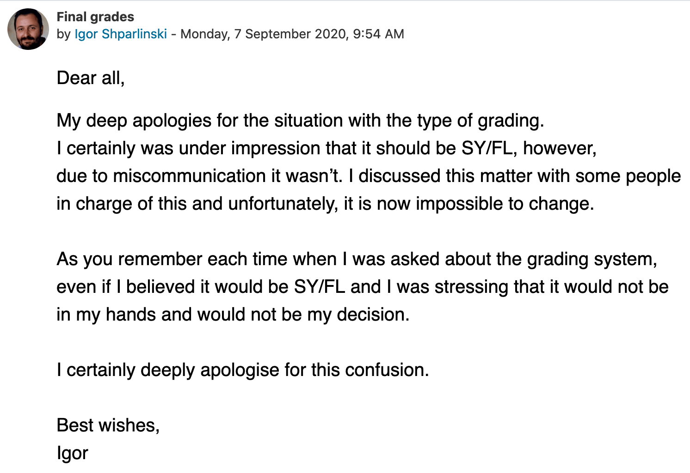
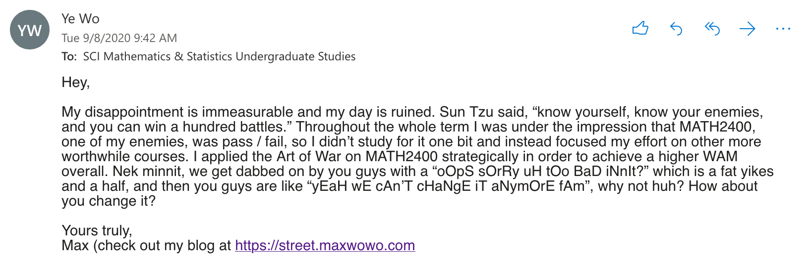

Aight so the entire cohort of MATH2400 just got dabbed on by the course admin yesterday. For those that are out of the loop, the lecturer for MATH2400, which is a filler course that all Software Engineering students have to take, announced at the start of the term that the course would be pass / fail. That's all well and good, until yesterday, after the term was over and the results were released, the lecturer sent out an announcement saying that the course is actually graded instead of pass / fail like he previously said, and that the mess was simply a result of miscommunication. He also said it's impossible to change the results at this stage, which is some bullshit.

My disappointment is immeasurable and my day is ruined. Sun Tzu said, "know yourself, know your enemy, and you shall win a hundred battles without loss". Throughout the whole of T2 I was under the impression that MATH2400, one of my enemies, was pass / fail. So I didn't study for it one bit and instead focused on other, more worthwhile things, like building Jikanban, the event scheduler that you can read about [here](time-board). So I channeled my inner protestor and sent a strongly-worded email to the Maths department, hoping that my immaculate wording and impeccable logic can make them realize the grave mistake that they've committed.

It's never too late to change.
