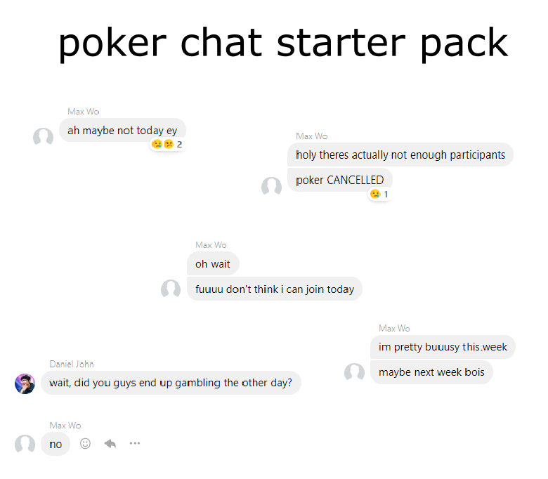

Imagine yourself trying to organize dinner with a bunch of friends. You send a message in the group chat and be like "surely we grab ramen this week ey" and everyone agrees. But then when you actually try to choose a time for the event, the chat turns into a clusterfuck with everyone sending in their availabilities at once, which makes it a chore to figure out a time that everyone's free at. This doesn't just apply to dinner plans, since it's the case for any event involving more than two attendees, like meetings, soccer games, poker nights, and whatever.

Moral of the story, event scheduling is everywhere and is a pain in the ass to do. But surely there's an app that makes this easier? Oh there are plenty of services out there that try to solve this issue, but none of them are there yet.

It's actually really hard to get this right. In order for people to actually want to use an event scheduling service, their friends must be on the platform as well, since otherwise who will these people try to schedule their events with? It's like the case with getting a job, in order to get a job you need experience, but you need to have a job in the first place to get experience, WTF right? This means that in order for a event scheduling service to succeed, it must be able to ramp the users up as fast as possible, which just translates to allowing people to start scheduling events, without needing to log in, as soon as they go on the page. This is what Discord does as well. Being a late comer to the voice call industry, as well as needing a critical mass of users to pop off, they made it insanely easy for people to start playing around with Discord without the need to log in. Obviously you wouldn't have access to as many features as you would if you were logged in, but that's ok, because it's also very straight forward to transition into an actual user, which is also something that an event scheduling service must support.

Oh but wait there's more. Ramping users up fast AF is pretty cool, but it's also equally as important to keep them in the ecosystem. This is what services like [when2meet](https://www.when2meet.com), which my team uses from time to time, fail to do. In when2meet you can create events, block out times that you're free in, invite others to do the same, and the website would help you find times that everyone's free in. Not bad, except the events are temporary, there's no sense of ownership from anything that you make or do there. It's just a tool, and it won't make you think about it unless you have something else to plan. This is obviously not ideal, and it shows that an event scheduling platform should aim to model itself as more as a social media platform, and less as something that people will just use from time to time and disregard once they're done. It should aim to own the users, not the other way around. Other perks to having an account system include connecting external calendars (Google Calender, iCalender, etc.) to the accounts so you don't have to manually block out times that you're busy in, and being able to look at what your friends are up to.

On top of all that, a successful event scheduler also needs to look cool. Nobody wants to use something that looks like it was made for 50 year old cubicle workers, no offence to them of course. Take [Doodle](https://doodle.com) as an example. Everything about this website reminds me of Microsoft Outlook, which I had the pleasure of using in my last internship. This is cool and all, but do you want to be reminded of work when you try to schedule a casual event in your spare time? Probably not ey. The ideal event scheduling platform needs to look like Discord. Sleek, cool, and nimble.

So why did I just ramble about event scheduling for the past four paragraphs? Because I'm building an event scheduler which incorporates everything that I talked about. It's called Jikanban, which is a pun on kanban and very roughly translates to time board.
