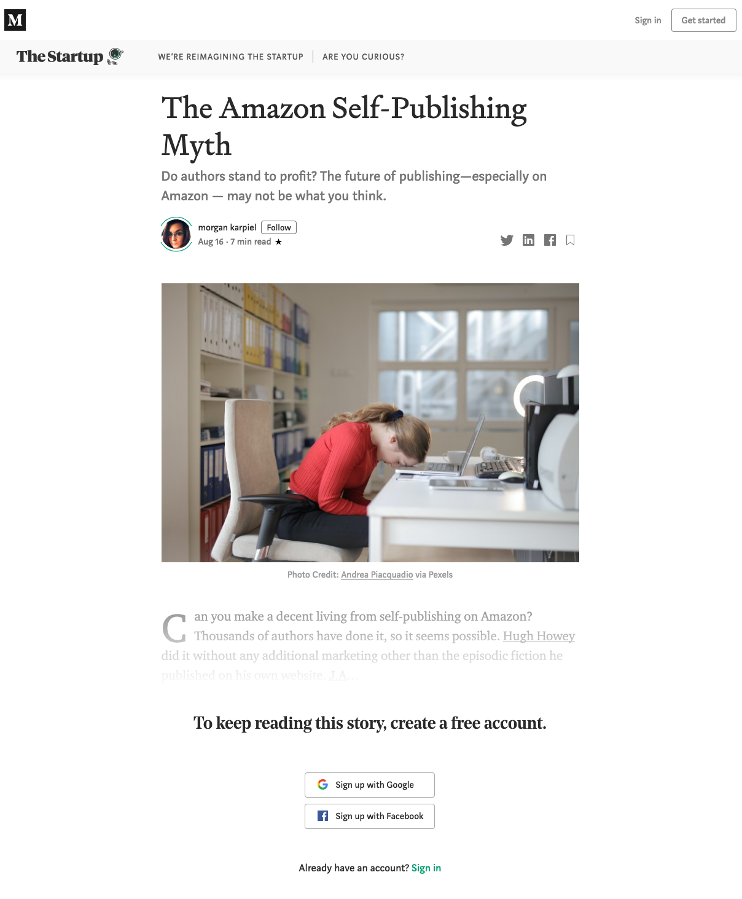

Medium's paywall can be a real pain in the ass sometimes. Let's be honest, who wants to pay every month just to read some sub-par arcitles on Medium when you can read all my quality posts for free? Nobody likes paywalls, and nobody should. But fear not, you can use a very simple trick to read as many articles as you want on Medium, and you won't even need an account.

When the paywall appears again, do the following:
1. If you're on Firefox, click on the icon beside the website address, it will probably look like a lock
2. In the box that opened, click "Clear Cookies and Site Data"
3. Clear that cookie
4. Refresh, and the paywall will disappear

Pretty freaking dope huh? Why does it work? I have no idea. After three years of Bachelor of Software Engineering I still have never used or learnt much about cookies, just thought clearing the cookie might do the trick, and it did. So that's that.

And if you're on Chrome then you're on your own. Good luck.
